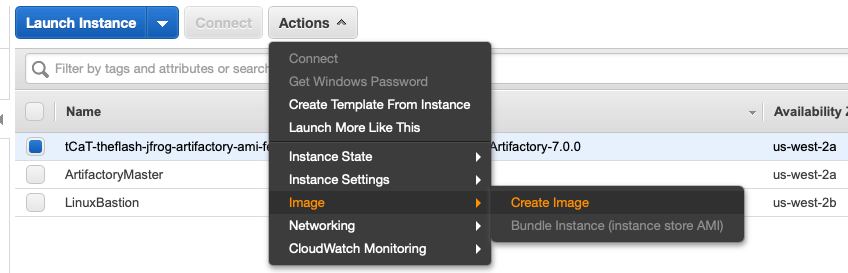
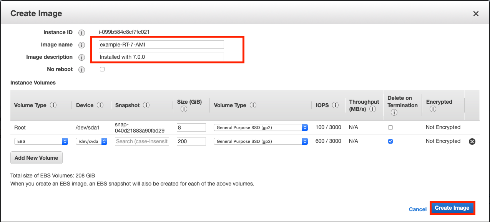
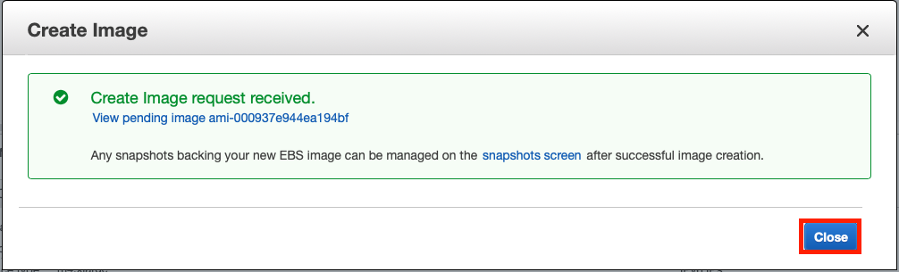
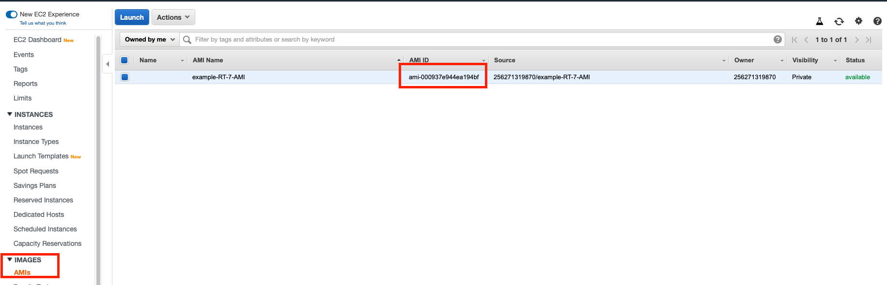
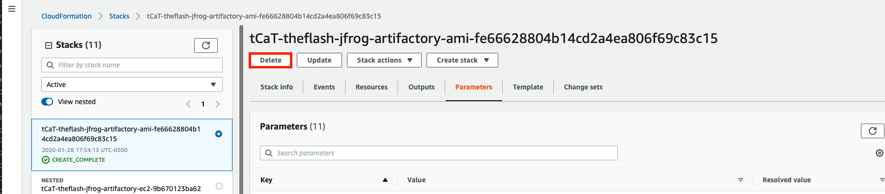

# quickstart-jfrog-artifactory-JFrog-Internal

## Pre-Requisite

Please ensure you have accepted the MarketPlace AMI before launching. Without doing so in the account, it will fail to launch the instance.

## Getting started

It is assumed you have installed and properly configured taskcat. You will also need a VPC created with a public Subnet. You can re-use one of the current CF templates to generate this, or create one on your own. Once that is complete, note down the `VPCID` and the `PublicSubnet1ID` for inputs.

Once that is compelete you will need to modify the .taskcat.yml with the following information:

```yaml
   tests:
     jfrog-artifactory-ami:
       parameters:
         KeyPairName: "$[taskcat_getkeypair]"
         ArtifactoryVersion: 7.0.0
         ArtifactoryRepoUrl: https://earlyaccess.jfrog.ioartifactory/enterprise-rpms
         RemoteAccessCIDR: "10.0.0.0/16"
         VPCID: `VPCID`
         PublicSubnet1ID: `PublicSubnet1ID`
         QSS3BucketName: "$[taskcat_autobucket]"
         QSS3KeyPrefix: "theflash/"
       template: templates/jfrog-ami-creation.template.yaml
       regions:
         - us-east-1
```

Please execute taskcat via `make test`. This will do the following steps:

1. Deploy a VM
2. Configure the VM with ansible and awscli
3. Download the ansible code to configure the instance
4. Execute Ansible
    1. Configure the Artifactory Repo
    2. Install the Artifactory version
    3. Install Java
    4. Install Nginx
    5. Remove SSH keys
    6. Disable the Artifactory Repo (To prevent further updates on deploying).
    7. Shutdown the instance.

## Manual Steps

Once you have run the cloudformation to build the instance, a few steps need to be performed to finish the process.

1. Create an Image, select the Instance that is stopped: 
2. Fill in the description and Name, then click Create Image 
3. Click close and wait for the Image creation process to complete. 
4. Now select AMI and wait for it to complete. You will now have the AMI ID for other uses. 
5. To cleanup, delete the Cloudformation stack that created the instance. 
6. Confirm deletion, by selecting "Delete Stack" 

You are now ready to submit the AMI for testing into the ec2 Cloudformation Templates, or upload for security scanning as an update.
