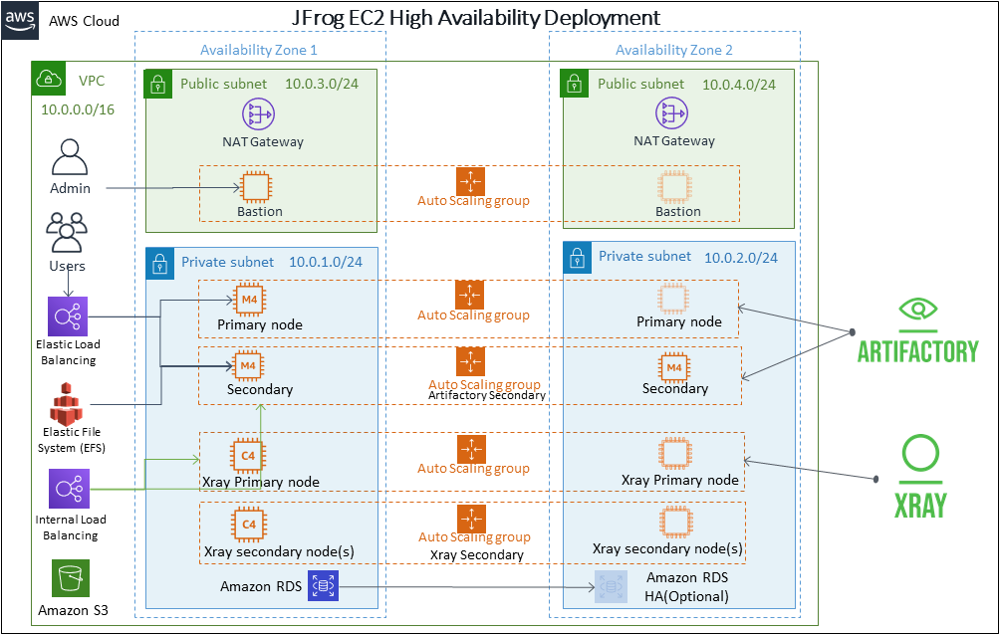

# quickstart-jfrog-artifactory
## JFrog Artifactory and Xray on the AWS Cloud

Three new Quick Starts deploy JFrog Artifactory and Xray on the Amazon Web Services (AWS) Cloud in 30-45 minutes. The available options for deployment use your choice of Amazon Elastic Compute Cloud (Amazon EC2), Amazon Elastic Container Service (Amazon ECS), or Amazon Elastic Kubernetes Service (Amazon EKS).

This Quick Start is for administrators who want to use JFrog Artifactory and Xray with the flexibility, scale, and availability of AWS.

Note that if you are using the Amazon EKS option, Amazon EKS is not available in all AWS Regions. For a current list of supported Regions, see the [AWS Regions and Endpoints webpage](https://docs.aws.amazon.com/general/latest/gr/rande.html#eks_region).

You can use the AWS CloudFormation templates included with the Quick Start to deploy JFrog Artifactory into a new or existing virtual private cloud (VPC) in your AWS account. The Quick Starts automates the following:

- Deploying JFrog Artifactory and Xray with Amazon EC2
- Deploying JFrog Artifactory and Xray with Amazon ECS
- Deploying JFrog Artifactory and Xray with Amazon EKS

For architectural details, best practices, and step-by-step instructions, see the deployment guide for JFrog Artifactory and Xray with [Amazon EC2](https://fwd.aws/dBWPz), [Amazon ECS](https://fwd.aws/Erdv5), or [Amazon EKS](https://fwd.aws/K87wK).

To post feedback, submit feature ideas, or report bugs, use the **Issues** section of this GitHub repo.
If you'd like to submit code for this Quick Start, please review the [AWS Quick Start Contributor's Kit](https://aws-quickstart.github.io/).
