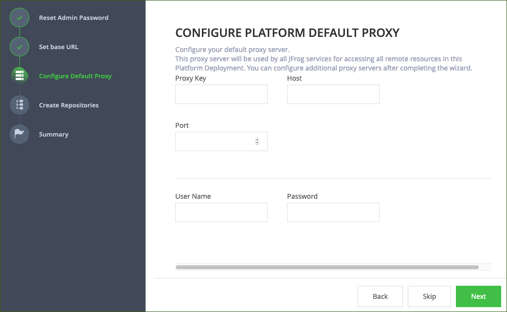
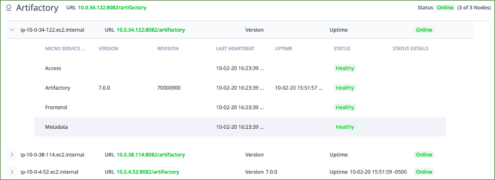
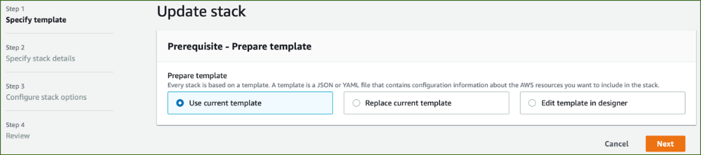
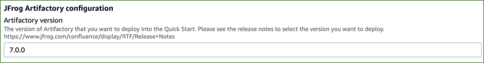
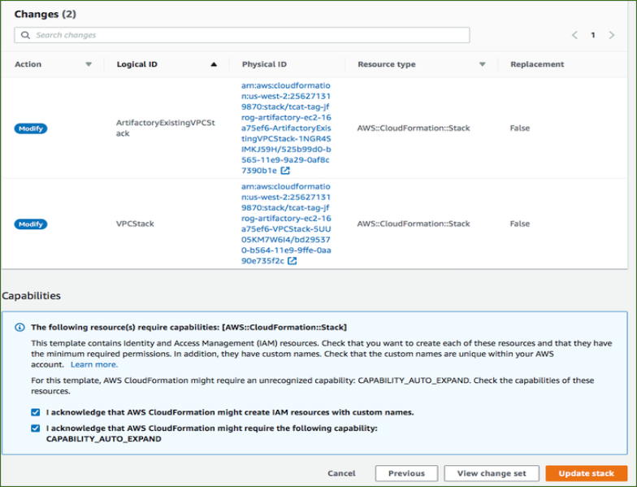
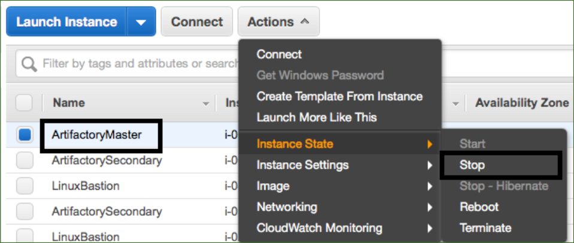
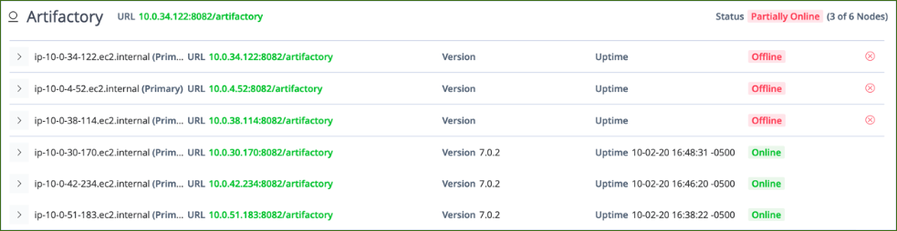

// Add steps as necessary for accessing the software, post-configuration, and testing. Don’t include full usage instructions for your software, but add links to your product documentation for that information.
//Should any sections not be applicable, remove them

== Get started with JFrog Artifactory
// If steps are required to test the deployment, add them here. If not, remove the heading

. Connect to Artifactory from `ArtifactoryURL`. You can find `ArtifactoryUrl` on the *Outputs* tab of the Artifactory primary stack. Verify that you can view the login screen (see <<get_started_1>>).

:xrefstyle: short
[#get_started_1]
.JFrog Artifactory login screen
[link=../{quickstart-project-name}/images/get_started_1.png]

NOTE: If you use a non-CA-signed certificate, you will receive a certificate warning when you attempt to access the page. This happens because the certificate doesn’t
match the ELB DNS unless you configure Amazon Route 53.

[start=2]
. The default user name and password for Artifactory are `admin` and `password`, respectively. Enter your credentials, and choose *Login*. For more information, see
JFrog Users and Groups.

This loads the setup wizard for initial configuration. Choose *Get Started*. (see <<get_started_2>>).

:xrefstyle: short
[#get_started_2]
.JFrog Artifactory welcome screen
[link=../{quickstart-project-name}/images/get_started_2.png]

This Quick Start handles the license key configuration during the deployment, so you are not prompted to activate your license.

[start=3]
. Set a secure administrator password for your deployment, and then choose *Next* (see <<get_started_3>>).

:xrefstyle: short
[#get_started_3]
.Set administrator password
[link=../{quickstart-project-name}/images/get_started_3.png]

[start=4]
. Optionally, configure the base URL setting. Because this deployment uses a proxy, it’s highly recommended that you update the base URL of Artifactory. More information
regarding this setting can be found in the https://www.jfrog.com/confluence/display/RTF/Configuring+Artifactory#ConfiguringArtifactory-GeneralSettings[Getting Started guide^] (see <<get_started_4>>).

:xrefstyle: short
[#get_started_4]
.Set Base URL screen
[link=../{quickstart-project-name}/images/get_started_4.png]

[start=5]
. Optionally, configure proxy settings for remote resources. (see <<get_started_5>>).

:xrefstyle: short
[#get_started_5]
.SConfigure proxy settings if required
[link=../{quickstart-project-name}/images/get_started_5.png]

[start=6]
. Select the repositories that you require, and then choose *Create* (see <<get_started_6>>).

:xrefstyle: short
[#get_started_6]
.Select repositories
[link=../{quickstart-project-name}/images/get_started_6.png]
image::../images/get_started_6.png[image_placeholder,width=648,height=439]

[start=7]
. Choose *Finish* (see <<get_started_7>>).

:xrefstyle: short
[#get_started_7]
.SFinal wizard screen
[link=../{quickstart-project-name}/images/get_started_7.png]

[start=8]
. Complete the administrative tasks by configuring the following:
* https://www.jfrog.com/confluence/display/RTF/Managing+Backups[Backups^]
* https://www.jfrog.com/confluence/display/JFROG/Regular+Maintenance+Operations[Regular Maintenance Operations^]
* https://www.jfrog.com/confluence/display/RTF/Authentication[Security^]

NOTE: Backups save to the local file system and do not persist if the EC2 instance is terminated. It is recommended to create snapshots of the primary instance.

== Updating Artifactory
// If Post-deployment steps are required, add them here. If not, remove the heading

If maintenance must be performed on the stack, ensure that you update the
CloudFormation stack rather than updating the infrastructure manually (this also applies to
updating Artifactory). The Artifactory version for this Quick Start is *7.0.x* (see <<update_1>>).

NOTE: Because the instances are backed by an AWS Marketplace AMI, the version you update must be available in AWS Marketplace, and a new map must be created
in the CloudFormation templates. Otherwise, the update will fail.

:xrefstyle: short
[#update_1]
.JFrog Artifactory status page shows the current version
[link=../{quickstart-project-name}/images/update_1.png]

. Choose the root stack, and then choose *Update* (see <<update_2>>).

:xrefstyle: short
[#update_2]
.Stack list and update button on the CloudFormation console
[link=../{quickstart-project-name}/images/update_2.png]

[start=2]
. On the *Prerequisite* screen, Choose *Use current template*, and then choose *Next*
(see <<update_3>>).

:xrefstyle: short
[#update_3]
.Update stack, prerequisite information
[link=../{quickstart-project-name}/images/update_3.png]

[start=3]
. Find the *Artifactory version* field by scrolling down (see <<update_4>>).

:xrefstyle: short
[#update_4]
.CloudFormation console update page (before you change the version)
[link=../{quickstart-project-name}/images/update_4.png]

[start=4]
. Enter the version number that you want to run (see <<update_5>>).

:xrefstyle: short
[#update_5]
.CloudFormation console update page (after you change the version)
[link=../{quickstart-project-name}/images/update_5.png]
image::../images/update_5.png[image_placeholder,width=648,height=439]

[start=5]
. Scroll down, and choose *Next*. Choose *Next* again, unless you want to change any other tags or policies. Select the two *I acknowledge* check boxes, and choose *Update stack* (see <<update_6>>).

:xrefstyle: short
[#update_6]
.Completing the update process
[link=../{quickstart-project-name}/images/update_6.png]

[start=6]
. Shut down the *ArtifactoryMaster* node. The proper process shuts down the nodes one at a time, starting with the Artifactory primary node. This will trigger a health check
failure on the load balancer. The load balancer will then delete the current running primary node and deploy a new primary node with the updated version (see <<update_7>>).

:xrefstyle: short
[#update_7]
.Shutting down Artifactory’s primary node
[link=../{quickstart-project-name}/images/update_7.png]

The Artifactory status page shows which instances are off-line (see <<update_8>>).

:xrefstyle: short
[#update_8]
.JFrog Artifactory service status page
[link=../{quickstart-project-name}/images/update_8.png]

IMPORTANT: To prevent issues and downtime, update only one node at a time. Ensure that you begin by shutting down the ArtifactoryPrimary node first. When
the new version starts up, shut down the secondary nodes one by one.

== Security
// Provide post-deployment best practices for using the technology on AWS, including considerations such as migrating data, backups, ensuring high performance, high availability, etc. Link to software documentation for detailed information.

By default, the load balancer does not match your certificate. You must configure the DNS
according to your organization’s configuration, which is highly recommended for a
production deployment.
When you create a new VPC, the private subnet CIDR is automatically provided to the
database security group `ArtifactoryBDSG`. In the new VPC, the private subnet is accessible
only from the public subnet.
When you deploy to an existing VPC, ensure similar rules are followed so that your
Artifactory nodes are not accessible directly from the internet. Also, ensure that the private
CIDR is correct and locked down. Avoid using `0.0.0.0/0`. If the subnet is a public subnet, it
will allow your MySQL database to be available from the internet.

== Storage
//Provide any other information of interest to users, especially focusing on areas where AWS or cloud usage differs from on-premises usage.

A major difference between running on-premises and on AWS is storage. Because S3 is
used, you are charged for what is currently in use rather than what may be allocated onpremises. Ensure to https://www.jfrog.com/confluence/display/RTF/Monitoring+Storage[monitor your usage^].