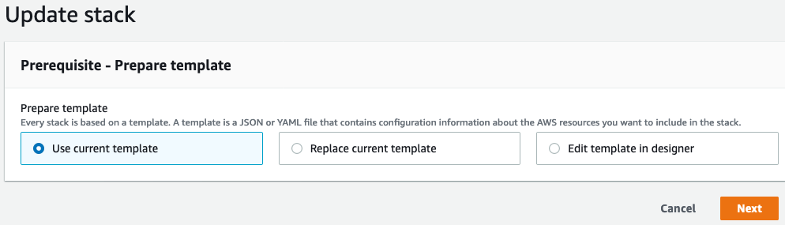
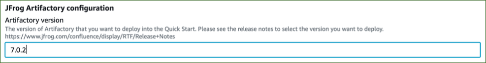

// Add steps as necessary for accessing the software, post-configuration, and testing. Don’t include full usage instructions for your software, but add links to your product documentation for that information.
//Should any sections not be applicable, remove them

== Get started with JFrog Artifactory
// If steps are required to test the deployment, add them here. If not, remove the heading

. On the *Outputs* tab of the JFrog Artifactory stack in the https://console.aws.amazon.com/cloudformation/[AWS CloudFormation console], find `ArtifactoryURL`. Connect to JFrog Artifactory using `ArtifactoryURL`.

NOTE: If you use a non-CA-signed certificate, you will see a certificate warning when you attempt to access the JFrog Artifactory URL. You can click through the warning to continue to the page. This warning displays when the certificate does not match the Elastic Load Balancer DNS (Domain Name System). As an option, you can configure Amazon Route 53 as the DNS service to avoid seeing this warning.

[start=2]
. On the JFrog Artifactory login page, enter the default credentials `admin`/`password`.
. Choose *Login*. 

NOTE: For more information, see
https://www.jfrog.com/confluence/display/JFROG/Users+and+Groups[Users and Groups].

[start=4]
. On the *Welcome to the JFrog Platform* page, choose *Get Started*. 
The Partner Solution handles JFrog license key configuration during the deployment, so you do not need to activate your license before getting started.

. On the *Reset Admin Password* page, set a secure administrator password for your deployment. Then choose *Next*.

. On the *Set Base URL* page, you can configure an optional base URL setting. Because this deployment uses a proxy, it's highly recommended that you set the JFrog Artifactory base URL. For more information, see https://www.jfrog.com/confluence/display/RTF/Configuring+Artifactory#ConfiguringArtifactory-GeneralSettings[Configuring Artifactory^].

. On the *Configure Platform Default Proxy* page, you can configure optional proxy settings for remote resources.

[start=8]
:xrefstyle: short
. On the *Create Repositories* page, select your desired package types. Then choose *Next*. (See <<get_started_6>>.)

[#get_started_6]
.Select repositories
[link=../{quickstart-project-name}/images/get_started_6.png]

[start=7]
. On the *Congratulations* page, choose *Finish*.

[start=8]
. Complete the following administrative tasks.
* https://www.jfrog.com/confluence/display/RTF/Managing+Backups[Backups^]
* https://www.jfrog.com/confluence/display/JFROG/Regular+Maintenance+Operations[Regular Maintenance Operations^]
* https://www.jfrog.com/confluence/display/RTF/Authentication[Security^]

NOTE: Backups save to the local file system and do not persist if the EC2 instance is terminated. It is recommended to create snapshots of the primary instance.

== Update {partner-product-short-name}
// If Post-deployment steps are required, add them here. If not, remove the heading

To perform maintenance on the stack, update the CloudFormation stack rather than updating the infrastructure manually. This also applies to updating JFrog Artifactory. The JFrog Artifactory version for this Partner Solution is 7.15.x, and the Xray version is 3.17.x. You can find current versions on the JFrog Artifactory *Service Status* page. For more information, see https://www.jfrog.com/confluence/display/JFROG/Monitoring+Service+Statuses[Monitoring Service Status].

NOTE: If you plan to upgrade both JFrog Artifactory and JFrog Xray, update JFrog Xray first.

=== Upgrade JFrog Xray 

. On the https://console.aws.amazon.com/cloudformation/[AWS CloudFormation console], choose the JFrog Xray stack. Then choose *Update*. (See <<xray_update_1>>.)

[#xray_update_1]
.JFrog Xray stack
[link=../{quickstart-project-name}/images/xray_update_1.png]

[start=2]
. Choose *Update nested stack*, and then choose *Update stack*. (See <<xray_update_2>>.)

[#xray_update_2]
.Update nested stack
[link=../{quickstart-project-name}/images/xray_update_2.png]
image::../images/xray_update_2.png[image_placeholder,width=486,height=331]

[start=3]
. Choose *Use current template*, and then choose *Next*. (See <<xray_update_3>>.)

[#xray_update_3]
.Update stack—Use current template
[link=../{quickstart-project-name}/images/xray_update_3.png]

[start=4]
. Enter the `XrayVersion` you want to run. Then choose *Next* twice, select the two acknowledgement check boxes, and choose *Update Stack*.

[start=5]
. Stop the JFrog Xray nodes one by one. For more information, see https://docs.aws.amazon.com/AWSEC2/latest/UserGuide/Stop_Start.html[Stop and start your instance]. Shutting down the nodes one at a time initiates a health check failure on the load balancer. The load balancer then deletes the current running node and deploys a net new primary node with the updated JFrog Xray version.

=== Upgrade JFrog Artifactory

IMPORTANT: To prevent issues and downtime, update only one node at a time. Shut down the `ArtifactoryPrimary` node first. After the new version starts, shut down the secondary nodes one by one.

. On the https://console.aws.amazon.com/cloudformation/[AWS CloudFormation console], choose the JFrog Artifactory root stack, and then choose *Update*. (See <<update_2>>.)

:xrefstyle: short
[#update_2]
.JFrog Artifactory root stack in the AWS CloudFormation console
[link=../{quickstart-project-name}/images/update_2.png]
image::../images/update_2.png[image_placeholder,width=648,height=439]

[start=2]
. On the *Prerequisite - Prepare template* screen, choose *Use current template*, and then choose *Next*. (See <<update_3>>.)

:xrefstyle: short
[#update_3]
.Prerequisite - Prepare template
[link=../{quickstart-project-name}/images/update_3.png]
image::../images/update_3.png[image_placeholder,width=648,height=439]

[start=3]
. In the *Artifactory version* field, enter the JFrog Artifactory version you want to run. (See <<update_5>>.)

:xrefstyle: short
[#update_5]
.Artifactory version
[link=../{quickstart-project-name}/images/update_5.png]

[start=4]
. Choose *Next*.

. Choose *Next* again, unless you want to change any other tags or policies. Select the two acknowledgment check boxes, and then choose *Update stack*.

. Stop the JFrog Artifactory nodes one by one, starting with the primary node `ArtifactoryMaster`. For more information, see https://docs.aws.amazon.com/AWSEC2/latest/UserGuide/Stop_Start.html[Stop and start your instance]. Shutting down the nodes one at a time initiates a health check failure on the load balancer. The load balancer then deletes the current running node and deploys a net new primary node with the updated JFrog Artifactory version.

NOTE: In JFrog Artifactory, you can see the instances that are offline on the *Service Status* page. For more information, see https://www.jfrog.com/confluence/display/JFROG/Monitoring+Service+Statuses[Monitoring Service Status].

== Security
// Provide post-deployment best practices for using the technology on AWS, including considerations such as migrating data, backups, ensuring high performance, high availability, etc. Link to software documentation for detailed information.

By default, the load balancer does not match your certificate. You must configure the DNS according to your organization's configuration, which is highly recommended for a
production deployment.

When you create a new VPC, the private subnet CIDR is automatically provided to the
database security group `Artifactory-rds-sg`. In the new VPC, the private subnet is accessible only from the public subnet.

When you deploy to an existing VPC, ensure that similar rules are followed so that your
JFrog Artifactory nodes are not accessible directly from the internet. Also, ensure that the private CIDR is correct and locked down. Avoid using `0.0.0.0/0`. If the subnet is a public subnet, it will allow your SQL database to be available from the internet.

== Storage
//Provide any other information of interest to users, especially focusing on areas where AWS or cloud usage differs from on-premises usage.

A major difference between running on-premises and on AWS is storage. Because Amazon S3 is used, you are charged for what is currently in use rather than what may be allocated on premises. Ensure that you https://www.jfrog.com/confluence/display/RTF/Monitoring+Storage[monitor your usage^].