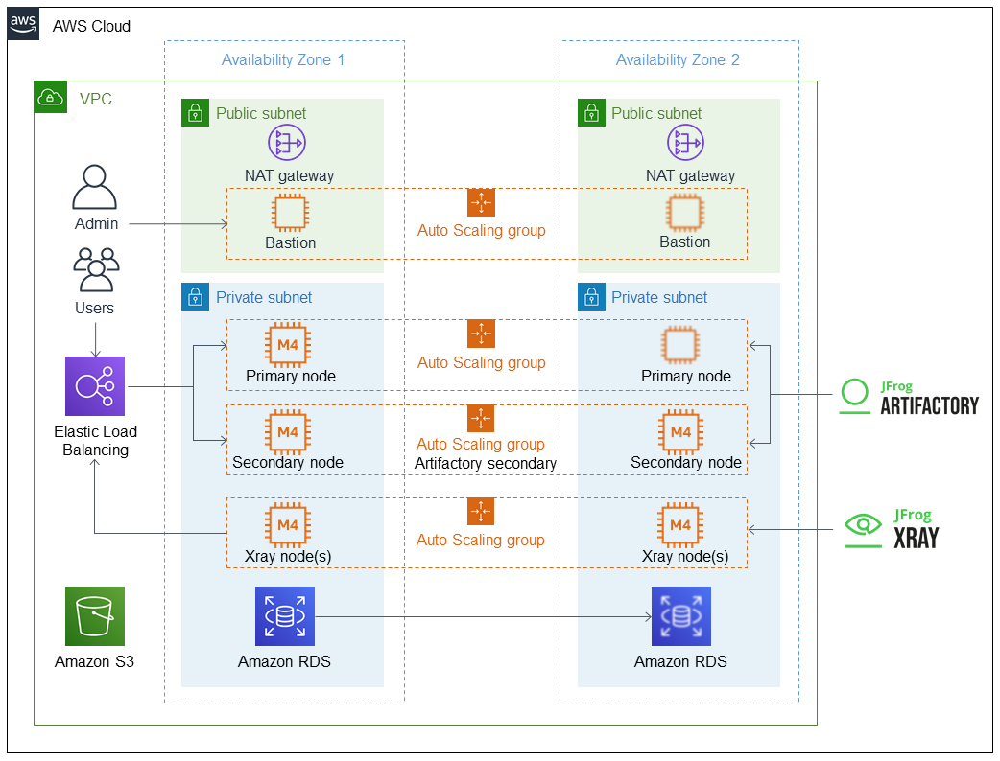

Deploying this Quick Start for a new virtual private cloud (VPC) with
*default parameters* builds the following _{partner-product-name}_ environment in the
AWS Cloud.

// Replace this example diagram with your own. Send us your source PowerPoint file. Be sure to follow our guidelines here : http://(we should include these points on our contributors giude)
[#architecture1]
.Quick Start architecture for _{partner-product-name}_ on AWS
[link=images/architecture_diagram.png]

As shown in Figure 1, the Quick Start sets up the following:

* An HA architecture that spans two Availability Zones.*
* A VPC configured with public and private subnets, according to AWS best practices, to
provide you with your own virtual network on AWS.*
* A private and encrypted S3 bucket for repository storage.

* A Network Load Balancer attached to the public subnets connecting via port 80 or 443
to the Artifactory primary and secondary nodes in the private subnets.

In the public subnets:

* Managed network address translation (NAT) gateways to allow outbound
internet access for resources in the private subnets.*
* A Linux bastion host in an Auto Scaling group to allow inbound Secure
Shell (SSH) access from the `RemoteAccess` CIDR to the EC2 instances in public
and private subnets.

In the private subnets:

// Add bullet points for any additional components that are included in the deployment. Make sure that the additional components are also represented in the architecture diagram.
** A https://docs.aws.amazon.com/AmazonRDS/latest/UserGuide/CHAP_MySQL.html[MySQL^] or https://docs.aws.amazon.com/AmazonRDS/latest/UserGuide/CHAP_PostgreSQL.html[PostgreSQL^] instance on Amazon RDS that’s accessible from the
private subnets on port 3306 or 5532, respectively.
** Two Amazon EC2 https://aws.amazon.com/autoscaling/[Auto Scaling^] groups, one for the primary node and one for the
secondary nodes.

NOTE: The purpose of the Automatic Scaling groups is for automatic deployment of
the primary node into another Availability Zone if a failure occurs. Do not modify the
number of instances.

*The template that deploys the Quick Start into an existing VPC skips
the components marked by asterisks and prompts you for your existing VPC
configuration.

=== Auto Scaling groups

The Auto Scaling groups are designed to have one primary node and multiple secondary
nodes. When an EC2 node or service fail, Auto Scaling groups automatically recreate the
instances. For this reason, all configurations are done on boot and result in a loss of any
data that are not stored in the Amazon RDS instance or S3 bucket.

=== Ansible init script

Ansible is installed and configured to run only on initial boot. Ansible, in cooperation with
the Auto Scaling group, initiates the required configuration and runs Artifactory. As a part
of this configuration, the nodes automatically join the HA cluster.

WARNING: Do not change the master key of the stack when updating the stack.
Doing so results in an unsupported configuration that future nodes cannot join.
To update an expired Secure Sockets Layer (SSL) certificate, change the
CloudFormation stack certificate and certificate key inputs, and then redeploy the
nodes (see Updating Artifactory). +
 +
If you change the certificate and certificate key
manually on the EC2 instances (instead of updating the CloudFormation stack), your
manual changes are lost at the next update or reboot, which results in an unwanted
configuration.