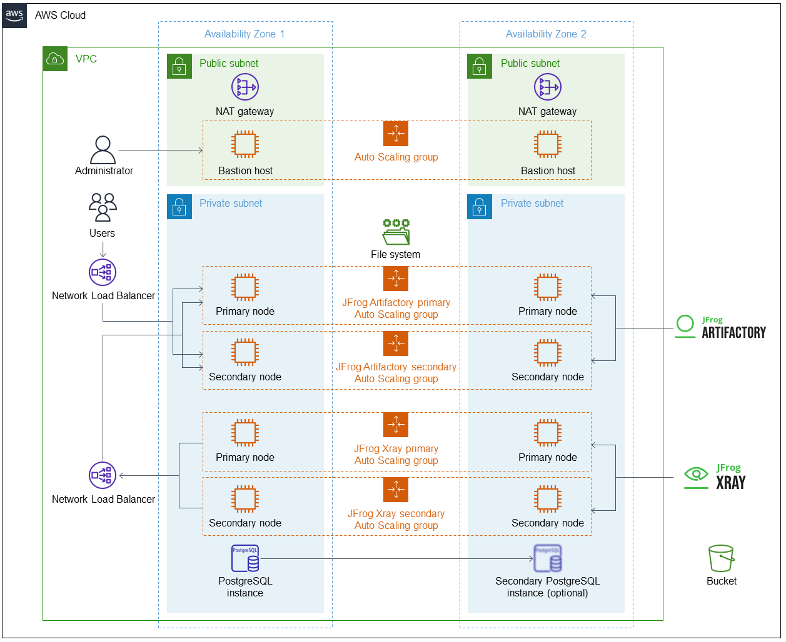

Deploying this Quick Start for a new virtual private cloud (VPC) with
default parameters builds the following {partner-product-name} environment in the
AWS Cloud.

// Replace this example diagram with your own. Send us your source PowerPoint file. Be sure to follow our guidelines here : http://(we should include these points on our contributors giude)
[#architecture1]
.Quick Start architecture for {partner-product-name} on AWS
[link=images/jfrog-architecture-diagram.png]

As shown in Figure 1, the Quick Start sets up the following:

* A highly available architecture that spans two Availability Zones.*
* A virtual private cloud (VPC) configured with public and private subnets according to AWS best practices, to provide you with your own virtual network on AWS.*
* In the public subnets:
** Managed network address translation (NAT) gateways to allow outbound internet access for resources in the private subnets.*
** A Linux bastion host in an Auto Scaling group to allow inbound Secure Shell (SSH) access to Amazon EC2 instances in public and private subnets.*
* In the private subnets:
** Two Amazon EC2 Auto Scaling groups for JFrog Artifactory primary and secondary nodes.
** If you deploy JFrog Xray, two Amazon EC2 Auto Scaling groups for JFrog Xray primary and secondary nodes.
** https://docs.aws.amazon.com/AmazonRDS/latest/UserGuide/CHAP_PostgreSQL.html[A PostgreSQL instance on Amazon Relational Database Service (Amazon RDS)] accessible from the private subnets. You can choose to deploy a secondary PostgreSQL instance.
* Amazon Elastic File System (Amazon EFS) file system for the JFrog Artifactory primary and secondary nodes. 
* A Network Load Balancer to distribute traffic among JFrog Artifactory primary and secondary nodes.
* If you deploy JFrog Xray, a Network Load Balancer for JFrog Xray to connect to JFrog Artifactory nodes.
* A private and encrypted Amazon Simple Storage Service (Amazon S3) bucket for repository storage.

[.small]#* The template that deploys the Quick Start into an existing VPC skips the components marked by asterisks and prompts you for your existing VPC configuration.#

=== Auto Scaling groups

The Auto Scaling groups are designed to have one primary node and multiple secondary
nodes. When an EC2 node or service fails, Auto Scaling groups automatically recreate the instances. For this reason, all configurations are made on boot and result in a loss of any data that are not stored in the Amazon RDS instance or S3 bucket.

NOTE:  It is recommended that you do not modify the number of instances when deploying the Quick Start. For more information, see https://aws.amazon.com/autoscaling/[AWS Auto Scaling^].

=== Ansible init script
Ansible is installed and configured to run only on initial boot. Ansible, in cooperation with the Auto Scaling group, initiates the required configuration to configure, install, and run Artifactory and Xray. As a part of this configuration, the nodes automatically join the HA cluster.

WARNING: Do not change the master key of the stack when updating the stack.
Doing so results in an unsupported configuration that future nodes cannot join.
To update an expired Secure Sockets Layer (SSL) certificate, change the
CloudFormation stack certificate and certificate key inputs, and then redeploy the
nodes (see Updating Artifactory). +
 +
If you change the certificate and certificate key manually on the Amazon EC2 instances (instead of updating the CloudFormation stack), your manual changes are lost at the next update or reboot, which results in an unwanted configuration.