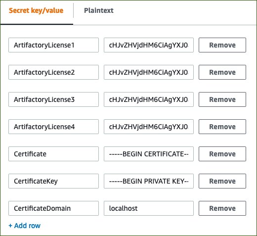

// We need to work around Step numbers here if we are going to potentially exclude the AMI subscription
=== Sign in to your AWS account

. Sign in to your AWS account at https://aws.amazon.com with an IAM user role that has the necessary permissions. For details, see link:#_planning_the_deployment[Planning the deployment] earlier in this guide.
. Make sure that your AWS account is configured correctly, as discussed in the link:#_technical_requirements[Technical requirements] section.

=== Prepare the certificate and certificate key

Due to the underlying JSON system, the parameters for both the certificate and certificate key must be edited by replacing their line endings.

. Copy the certificate into a text editor, and view line endings. Line endings on Windows and Linux terminate in CRFL and LF, respectively.
. Remove all CRFL or LF characters, and replace them with the | (pipe) character. This puts the certificate on a single line.
. Follow the same process for the certificate key.

=== Add the license keys and certificate to AWS Secrets Manager

. Open AWS Secrets Manager in the same Region in which you deploy the Quick Start.
. Choose Store a new secret.
. Choose Other type of secret.
. For the secret key value, create seven rows for the Artifactory licenses and certificate information.
. Key names should be as follows, with the key values being Artifactory license keys and certificate details (see <<secret_manager>>)):
.. `ArtifactoryLicense1`
.. `ArtifactoryLicense2`
.. `ArtifactoryLicense3`
.. `ArtifactoryLicense4`
.. `Certificate`
.. `CertificateKey`
.. `CertificateDomain`

:xrefstyle: short
[#secret_manager]
.Secrets Manager key-value page
[link=../{quickstart-project-name}/images/secrets_manager.png]

[start=6]
. Choose *Next*.
. Provide a secret name. This name is used to deploy this Quick Start.
. Choose *Next* twice.
. Choose *Store*.

// Optional based on Marketplace listing. Not to be edited
ifdef::marketplace_subscription[]
=== Subscribe to the {partner-product-name} AMI

This Quick Start requires a subscription to the AMI for {partner-product-name} in AWS Marketplace.

. Sign in to your AWS account.
. {marketplace_listing_url}[Open the page for the {partner-product-name} AMI in AWS Marketplace], and then choose *Continue to Subscribe*.
. Review the terms and conditions for software usage, and then choose *Accept Terms*. +
  A confirmation page loads, and an email confirmation is sent to the account owner. For detailed subscription instructions, see the https://aws.amazon.com/marketplace/help/200799470[AWS Marketplace documentation^].

. When the subscription process is complete, exit out of AWS Marketplace without further action. *Do not* provision the software from AWS Marketplace—the Quick Start deploys the AMI for you.
endif::marketplace_subscription[]
// \Not to be edited

=== Launch the Quick Start

NOTE: You are responsible for the cost of the AWS services used while running this Quick Start reference deployment. There is no additional cost for using this Quick Start. For full details, see the pricing pages for each AWS service used by this Quick Start. Prices are subject to change.

. Sign in to your AWS account, and choose one of the following options to launch the AWS CloudFormation template. For help with choosing an option, see link:#_deployment_options[deployment options] earlier in this guide.

[cols=2*]
|===
^|https://fwd.aws/DzEkv[Deploy {partner-product-name} into a new VPC on AWS^]
^|https://fwd.aws/5wnqz[View template^]

^|https://fwd.aws/Ee88A[Deploy {partner-product-name} into an existing VPC on AWS^]
^|https://fwd.aws/jMBXD[View template^]
|===

WARNING: If you’re deploying {partner-product-name} into an existing VPC, make sure that your VPC has two private subnets in different Availability Zones for the workload instances, and that the subnets aren’t shared. This Quick Start doesn’t support https://docs.aws.amazon.com/vpc/latest/userguide/vpc-sharing.html[shared subnets^]. These subnets require https://docs.aws.amazon.com/vpc/latest/userguide/vpc-nat-gateway.html[NAT gateways^] in their route tables, to allow the instances to download packages and software without exposing them to the internet.

Also, make sure that the domain name option in the DHCP options is configured as explained in the http://docs.aws.amazon.com/AmazonVPC/latest/UserGuide/VPC_DHCP_Options.html[Amazon VPC documentation^]. You provide your VPC settings when you launch the Quick Start.

Each deployment takes about {deployment_time} to complete.

[start=2]
. Check the AWS Region that’s displayed in the upper-right corner of the navigation bar, and change it if necessary. This is where the network infrastructure for {partner-product-name} will be built. The template is launched in the {default_deployment_region} Region by default.

// *Note:* This deployment includes Amazon EFS, which isn’t currently supported in all AWS Regions. For a current list of supported Regions, see the https://docs.aws.amazon.com/general/latest/gr/elasticfilesystem.html[endpoints and quotas webpage].

[start=3]
. On the *Create stack* page, keep the default setting for the template URL, and then choose *Next*.
. On the *Specify stack details* page, change the stack name if needed. Review the parameters for the template. Provide values for the parameters that require input. For all other parameters, review the default settings and customize them as necessary.

// In the following tables, parameters are listed by category and described separately for the two deployment options:

// * Parameters for deploying {partner-product-name} into a new VPC
// * Parameters for deploying {partner-product-name} into an existing VPC