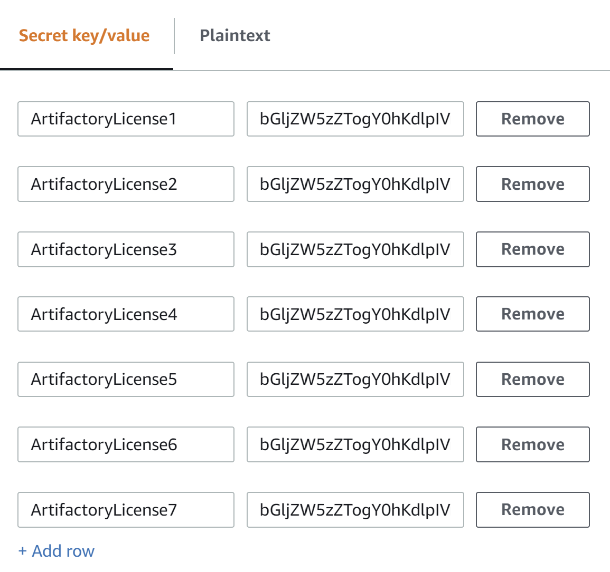

// If no preperation is required, remove all content from here

// ==== Prepare your AWS account

// _Describe any setup required in the AWS account prior to template launch_

// ==== Prepare your {partner-company-name} account

// _Describe any setup required in the partner portal/account prior to template launch_

=== Prepare for the deployment
// _Describe any preparation required to complete the product build, such as obtaining licenses or placing files in S3_

==== Add JFrog Artifactory license keys to AWS Secrets Manager
. Open the https://console.aws.amazon.com/secretsmanager/home?region=us-east-1#!/home[AWS Secrets Manager console].
. In the top toolbar, choose the AWS Region where you deploy the Partner Solution.
. Choose *Store a new secret*.
. On the *Store a new secret* page, choose *Other type of secret*.
. In the *Key/value pairs* section, create a row for each JFrog Artifactory license. In the first column, enter `ArtifactoryLicense<n>`, substituting a number for `<n>` (for example, `ArtifactoryLicense1`, `ArtifactoryLicense2`). In the second column, enter the license.

:xrefstyle: short
[#secret_manager_licenses]
.Secrets Manager key-value licenses page
[link=../{quickstart-project-name}/images/secret_manager_licenses.png]

[start=6]
. Choose *Next*.
. Provide a secret name to use when deploying this Partner Solution.
. Choose *Next* twice.
. Choose *Store*.

==== Add certificate and certificate keys to Secrets Manager

. Open the certificate in a text editor of your choice and copy the contents to the clipboard.
. In the Secrets Manager console, choose *Store a new secret*.
. On the *Store a new secret* page, choose *Other type of secret*.
. In the *Key/value pairs* section, create three rows. In the first row, enter `Certificate` in the first column. Paste the certificate into the second column.
. Open the certificate key in a text editor and copy the contents to the clipboard.
. In the first column of the second row, enter `CertificateKey`. In the second column, paste the certificate key.
. In the first column of the third row, enter `CertificateDomain`. Enter `localhost` into the second column.

:xrefstyle: short
[#secret_manager_certificate]
.Secrets Manager key-value certificates page
[link=../{quickstart-project-name}/images/secrets_manager_certificates.png]
image::../images/secrets_manager_certificates.png[image_placeholder,width=447,height=241]

NOTE: When you copy the certificate and certificate key from an editor, the contents are copied as a single line of text. This process converts carriage return and line feed (CRLF) or line feed (LF) characters to spaces.

// Optional based on Marketplace listing. Not to be edited
ifdef::marketplace_subscription[]
===== Subscribe to the CentOS AMI

This Partner Solution requires a subscription to the Amazon Machine Image (AMI) for CentOS in AWS Marketplace.

Perform the following steps:

. Sign in to your AWS account.
. {marketplace_listing_url}[Open the page for the CentOS AMI in AWS Marketplace], and then choose *Continue to Subscribe*.
. Review the terms and conditions for software usage, and then choose *Accept Terms*. +
  A confirmation page loads, and an email confirmation is sent to the account owner. For detailed subscription instructions, see the https://aws.amazon.com/marketplace/help/200799470[AWS Marketplace documentation^].

. When the subscription process is complete, exit out of AWS Marketplace without further action. *Do not* provision the software from AWS Marketplace — the Partner Solution deploys the AMI for you.
endif::marketplace_subscription[]
// \Not to be edited